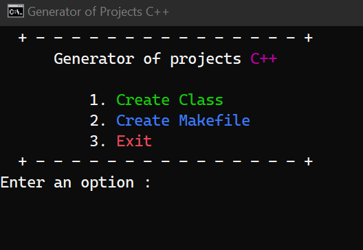

# Generator of Projects C++ 

The purpose of this project is to optimize the project implementation process in C++,  
allowing classes to be created quickly. Only attributes are needed to implement the body   
and basic methods of the classes, methods such as constructors, getter and setter.  
This project was created with c++.

### Pre-requirements 📋

* 	[g++](https://osdn.net/projects/mingw/releases/) 
	
## Installation

Download [code](https://github.com/DavidVillalobos/generator-projects-cplusplus/archive/master.zip), and place them in the space of your choice.  
For build project write the following command inside the project folder:  
```cmd
cd generator-projects-cplusplus
build
```
## Usage  

For use, after build the project, Run the file run.bat
or open the terminal in project folder and execute the following command:  
~~~cmd
cd build
genc++
~~~

Enter an option and create your project  
   

## Author

 * [David Villalobos](https://github.com/DavidVillalobos)

## Contributing

For changes, please open an issue first to discuss what you would like to change.

## License
This project is under the license of MIT  

