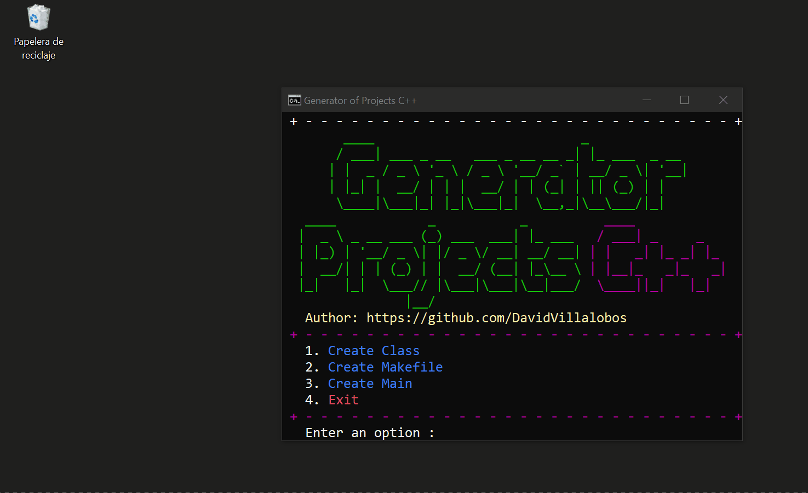
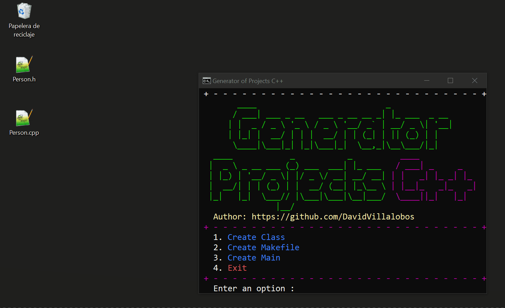
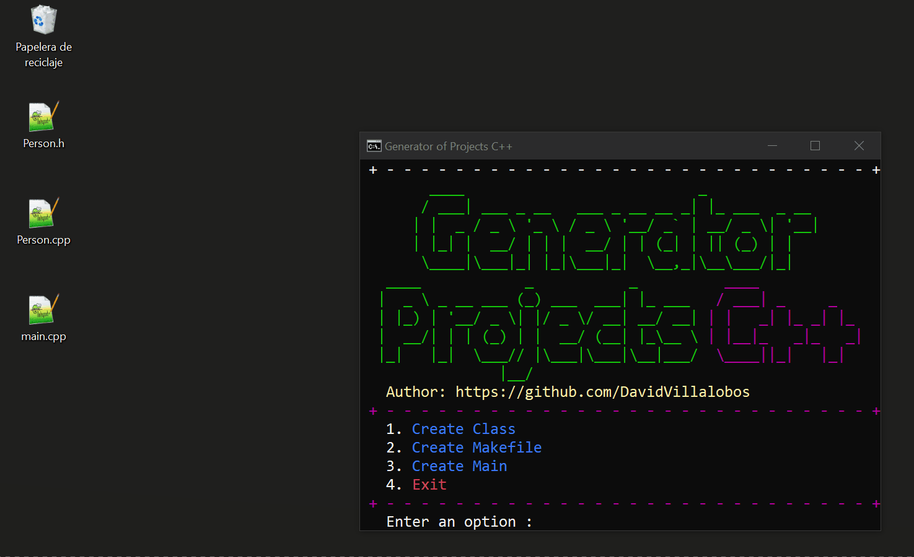
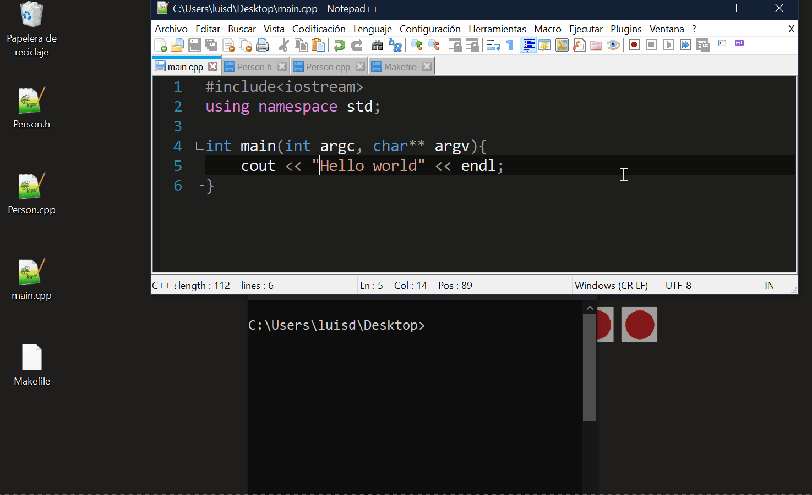

# Generator of Projects C++ 

The purpose of this project is to optimize the project implementation process in C++,  
allowing classes to be created quickly. Only attributes are needed to implement the body   
and basic methods of the classes, methods such as constructors, getter and setter.  
This project was created with c++.

  

## Pre-requirements 📋

* 	[g++](https://osdn.net/projects/mingw/releases/) 
## Installation
### Release

Download the code available in [releases](https://github.com/DavidVillalobos/generator-projects-cplusplus/releases/tag/v1.0)   

Unzip the file in the space where you want and for use run the GenC++.exe file    

### Last version  

Download [code](https://github.com/DavidVillalobos/generator-projects-cplusplus/archive/master.zip), and place them in the space of your choice.  
For build project write the following command inside the project folder:  
```cmd
cd generator-projects-cplusplus
build
```
For use, after build the project, Run the file run.bat or open terminal in project folder and execute the following command:  
~~~cmd
cd build
genc++
~~~
Now enter an option and create your project :D  

## Usage
See how to use it with the following demos 
## Create a classes
  

## Create a main
  

## Create a Makefile
  

## Result
Finally, the idea is that projects can be implemented in c ++ more quickly 
 

## Author

 * [David Villalobos](https://github.com/DavidVillalobos)

## Contributing

For changes, please open an issue first to discuss what you would like to change.

## License
This project is under the license of MIT  

