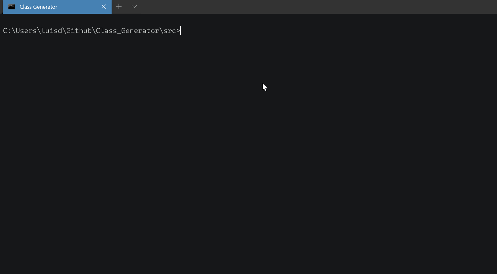

# Class Generator
The purpose of this project is to optimize the process of implementing projects in C ++, allowing to create classes quickly, implementing the body and the basic methods of the classes for the attributes, like getter and setter, also builder with and without parameters. This project was created with python
### Pre-requirements 📋

[Python](https://www.python.org/) minimum the 3 version
## Installation
Only need to download a file class_generator.py from this repository  
You can download it with curl like:  
```bash
curl https://raw.githubusercontent.com/DavidVillalobos/Class_Generator/master/src/class_generator.py --output class_generator.py
```
## Usage  
In the project folder, start a terminal  
To create the classes, there are two ways 
### 1. Sending the data as arguments
> Running the generator_class file allows sending the data as an argument  
Example:    
Creating the person class with id, name and age    
in offline mode with the overloaded constructor  

    

### 2. Sending the data interactively
> It also allows to be created interactively:    
Example:  
Creating the student class with name, card and average   
in inline mode with the constructor not overloaded   

    

## Authors
 * [David Villalobos](https://github.com/DavidVillalobos)
## Contributing
Pull requests are welcome. For major changes, please open an issue first to discuss what you would like to change.
## License

